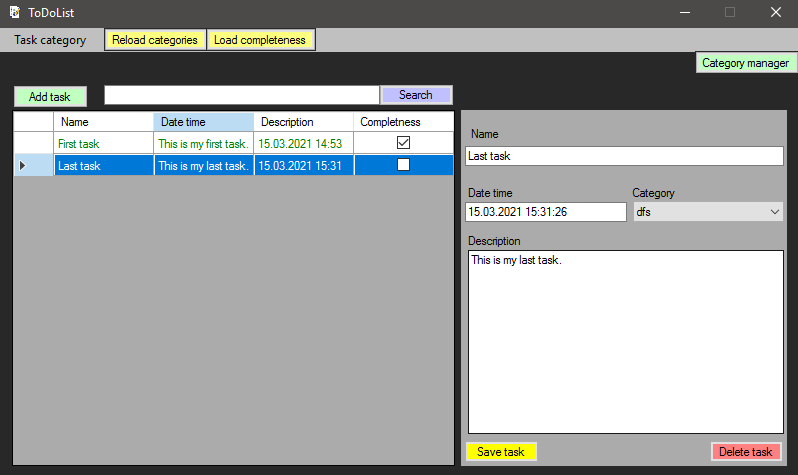
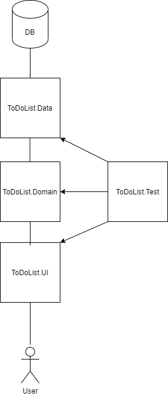

## ToDoList

## Description
> This program is designed to store a list of tasks. Instead of keeping all your tasks on paper, you can use this program.



## Technologies
- Windows Forms
- EntityFramework - v6.4.4
- AutoMapper - v10.1.1
- MsTest - v2.1.1
- Moq - v4.15.2

## Lite UML


## Layers
I use three-tiered architecture:
- ToDoList.Data - layer for data storage
- ToDoList.Domain - later for BL
- ToDoList.Test - layer for tests
- ToDoList.UI - layer for user intrerface (WF)

## How to start
- Go to ToDoList.Data/App.config
- Change path in connectionStrings:
``` XML
<connectionStrings>
    <add name = "TaskDbContext"
         providerName="System.Data.SqlClient"
         connectionString="Server=(LocalDB)\MSSQLLocalDB;
                           Database=ToDoList;
                           Integrated Security=True;"/> <!-- change here. -->
  </connectionStrings>
```

- If you need change DB name go to ToDoList.Data/Context/TaskDbContext.cs:
``` CS
    public class TaskDbContext : DbContext
    {
        public TaskDbContext() : base("ToDoList") { } // change here.
        public DbSet<TaskEntity> Tasks { get; set; }
    }
```

## Versions
v1.0.0 - CRUD functional with user-friendly interface.

## How to participate
throw all your request in "pullRequests" branch

## Features
- CRUD functional
- User-friendly interface

## To Do
- Mark whether the task is completed or not
- Task menu
- Fix bug with task update

## Status
I'm actively developing this project

## Special thanks to:
- You can be the first :)

## Connect with me
If you want to improve something or fix a bug, you can send me an email maxmamamama@gmail.com